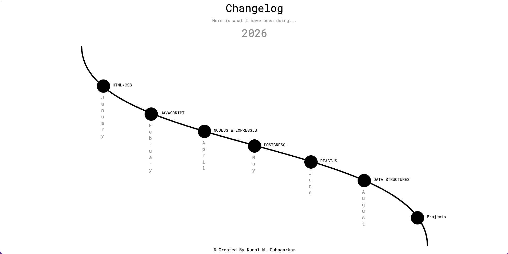

# Changelog Component

A changelog component built with plain HTML and CSS. It shows a curved timeline with a marker for each topic learned over the year, along with the month it was covered.

This project is a practice exercise in **CSS positioning and layout** (`position: relative` / `absolute`, `transform`, flexbox) combined with an inline **SVG** path for the timeline.

## Preview


The page displays:

- A centered heading with a short intro and the year (**2026**)
- A curved black timeline drawn with an SVG `<path>`
- Seven circular markers placed along the curve, each with a subject label and a month label

| # | Subject              | Month    |
|---|----------------------|----------|
| 1 | HTML/CSS             | January  |
| 2 | JavaScript           | February |
| 3 | NodeJS & ExpressJS   | April    |
| 4 | PostgreSQL           | May      |
| 5 | ReactJS              | June     |
| 6 | Data Structures      | August   |
| 7 | Projects             | -        |

## Tech Stack

- **HTML5**: semantic structure and inline SVG
- **CSS3**: flexbox, absolute positioning, `transform`, vertical `writing-mode` for month labels
- **Google Fonts**: Roboto and Roboto Mono

## Project Structure

```
.
├── index.html   # Page markup: heading, SVG timeline, circle markers, footer
├── style.css    # Layout, positioning, and typography
└── README.md
```

## Getting Started

1. Clone or download the project:
   ```bash
   git clone <your-repo-url>
   cd <project-folder>
   ```
2. Open `index.html` in your browser. No build step or dependencies are needed.

Optionally, use a local server such as the VS Code **Live Server** extension.

## How It Works

- `#main-container` is the positioning context (`position: relative`).
- The timeline curve is a single SVG path (`1305 × 750`) placed inside `#line`.
- Each `#circle-N` is absolutely positioned inside the container and moved into place with `transform: translateX() translateY()`, so it sits on the curve.
- `.subject-text` is placed over each circle, and `.month-text` uses `writing-mode: vertical-rl` with `text-orientation: upright` to stack the month name vertically beside the marker.


## Known Limitations and Ideas for Improvement

- Circle positions use fixed pixel offsets, so the layout is designed for wide desktop screens and does not yet adapt to smaller viewports. Adding media queries, or switching to percentage-based positioning or a scaling SVG `viewBox`, would make it truly responsive.
- Accessibility: consider adding `aria-label`s or a visually hidden list so screen readers can read the timeline entries in order.

## Author

Created by **Kunal M. Guhagarkar**

## License

This project is open for learning and personal use. Add a license (for example MIT) if you plan to distribute it.